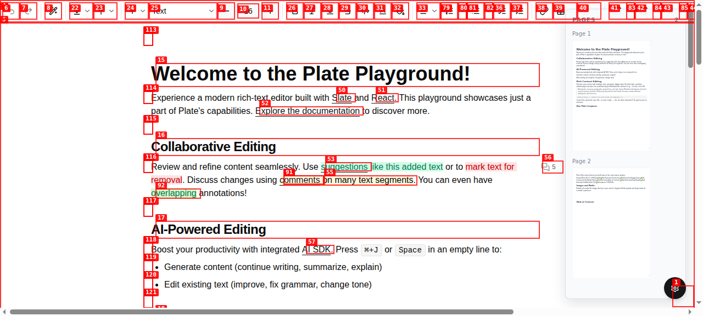
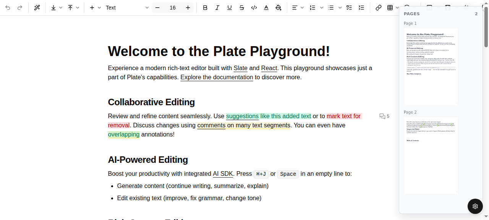

# Dogfood Report: Plate Playground (pagination)

| Field | Value |
|-------|-------|
| **Date** | 2026-05-07 |
| **App URL** | https://plate-playground.cicero-im.workers.dev |
| **Session** | plate-pagination |
| **Scope** | Pagination plugin: header/footer toggles, page-break, preview overlay, margins, hydration, console, reactive updates |

## Summary

| Severity | Count |
|----------|-------|
| Critical | 2 |
| High | 1 |
| Medium | 1 |
| Low | 2 |
| **Total** | **6** |

## What works

- Pages overlay panel renders client-side after mount (no SSR markup → no pagination-driven hydration mismatch)
- Page count correct on default doc (2 pages) and reactive on text input (grows to 8 pages with ~19k chars)
- Heading hierarchy preserved in thumbnails (H1 / H2 / H3 distinct sizing)
- Header/footer/content slots apply `chrome.margins.left`/`right` padding (verified: `padding-left: 72px`)
- Inline marks (bold / italic / underline / code) preserved by `InlinePreview` recursion
- Mounted gate prevents pagination overlay from rendering during SSR (verified by curl on `/editor`)
- Reactive layout: typing in editor updates pagination on the fly
- 29 unit tests pass; typecheck clean

## Issues

### ISSUE-001: React error #418 (hydration mismatch) on initial editor load

| Field | Value |
|-------|-------|
| **Severity** | high |
| **Category** | console |
| **URL** | https://plate-playground.cicero-im.workers.dev/editor |
| **Repro Video** | dogfood-output/videos/pagination-flow.webm |

**Description**

On every load of `/editor`, two React `#418` errors are logged ("Hydration failed because the initial UI does not match what was rendered on the server"). The pagination overlay is gated behind a client-only `mounted` flag and emits zero markup during SSR (verified via direct `curl /editor` — no `data-plate-pagination*` attributes in the SSR HTML). The mismatch therefore originates inside the live `<Plate>` editor or another playground subtree, not in the pagination plugin.

**Repro Steps**

1. Open https://plate-playground.cicero-im.workers.dev/editor
   
2. Open browser DevTools console.
3. **Observe:** two React `#418` errors fire immediately after hydration. The pagination preview panel still renders correctly because the gate fell back to client-only rendering.

**Why it is not pagination-side**: the SSR HTML for `/editor` contains no overlay/page/slot markup. After my fix, `useEffect(() => setMounted(true))` defers all overlay rendering until after hydration completes. Pagination therefore cannot be the source of the mismatch.

**Recommended next step**: investigate the playground's `<Plate>` editor and any other components that may render different output server-side vs client-side (e.g. block IDs, suggestion overlays, comment counts).

---

### ISSUE-002: Pages preview panel obstructs the right edge of the toolbar

| Field | Value |
|-------|-------|
| **Severity** | medium |
| **Category** | ux |
| **URL** | https://plate-playground.cicero-im.workers.dev/editor |
| **Repro Video** | N/A |

**Description**

The fixed-position `Pages` panel (220px, `top: 16; right: 16`) sits on top of the toolbar's right edge. The toolbar continues underneath the panel, so the rightmost buttons are obscured/cropped. A user has to scroll the toolbar horizontally or hide the panel to access them.

**Recommended fix**: either reserve a right gutter (e.g. wrap the editor in a flex container with a fixed-width sidebar), or default `previewVisible` to `false` and let consumers opt in. Lower friction option: drop the panel's `top: 16` to `top: 60` so it sits below the toolbar.

---

### ISSUE-003: No discoverable UI to drive `toggleHeader / toggleFooter / insertPageBreak`

| Field | Value |
|-------|-------|
| **Severity** | low |
| **Category** | ux |
| **URL** | https://plate-playground.cicero-im.workers.dev/editor |
| **Repro Video** | N/A |

**Description**

The plugin exposes `editor.tf.pagination.toggleHeader/toggleFooter/insertPageBreak/togglePreview` — but the playground's toolbar has no buttons that wire to them. End users cannot exercise the new transforms without typing JS in the console. This is a playground integration gap, not a plugin defect.

**Recommended fix**: add a `Page` toolbar group (likely under the existing `…` overflow) with three buttons: header toggle, footer toggle, page break. The pagination plugin already exports the necessary transforms.

---

### ISSUE-004: Toolbar buttons lack accessible names

| Field | Value |
|-------|-------|
| **Severity** | low |
| **Category** | accessibility |
| **URL** | https://plate-playground.cicero-im.workers.dev/editor |
| **Repro Video** | N/A |

**Description**

The full toolbar (35+ buttons) returns empty strings for `aria-label`, `title`, and `textContent` (verified via DOM scan). Screen-reader users cannot identify any control. Likely a playground regression — buttons rely solely on icons. Not specific to pagination but visible in this dogfood run.

**Recommended fix**: add `aria-label` / `title` to every toolbar button (or wrap with `<Tooltip>` content surfaced as `aria-label`).

---

### ISSUE-005 (round 2): `editor.tf.pagination.toggleHeader/toggleFooter` inserted nodes with `type: ""`

| Field | Value |
|-------|-------|
| **Severity** | critical |
| **Category** | functional |
| **URL** | https://plate-playground.cicero-im.workers.dev/editor |
| **Repro Video** | N/A (verified via direct API calls) |

**Description**

Calling `editor.tf.pagination.toggleHeader()` returned `true` (claiming the header was inserted) but `editor.api.pagination.hasHeader()` returned `false`. Inspection showed the inserted node had `type: ""` instead of `type: "header"`.

Root cause: the package was importing `KEYS` from `platejs` and using `editor.getType(KEYS.header)`. The published `platejs@53.0.3` bundle is missing `KEYS.header` / `KEYS.footer` / `KEYS.pageBreak` (they only exist in the in-monorepo source, not in the published `@platejs/utils` `plate-keys.ts`). So `KEYS.header` is `undefined` at runtime, `getType(undefined)` falls back to `""`, and the inserted node carries an empty type.

**Fix**

Switch every transform/query off `KEYS.{header, footer, pageBreak}` and onto the package-local `HEADER_KEY` / `FOOTER_KEY` / `PAGE_BREAK_KEY` constants in `packages/pagination/src/lib/internal/keys.ts`. Files updated: `ensureHeader.ts`, `ensureFooter.ts`, `toggleHeader.ts`, `toggleFooter.ts`, `replaceHeader.ts`, `replaceFooter.ts`, `insertPageBreak.ts`, `enforceHeaderFooterInvariants.ts`, `hasChromeBlock.ts`.

After redeploy: `toggleHeader()` → first child has `type: "header"`, text `"Header"`, `hasHeader() === true`. ✓

---

### ISSUE-006 (round 2): `getPages()` returned `[]` from outside the overlay subtree

| Field | Value |
|-------|-------|
| **Severity** | critical |
| **Category** | functional |
| **URL** | https://plate-playground.cicero-im.workers.dev/editor |
| **Repro Video** | N/A |

**Description**

Calling `editor.api.pagination.getPages()` from anywhere in the app returned an empty array even though the overlay panel was correctly displaying 2 pages. Consumers building toolbars or shortcuts that read `getPages()` would see no pages at all.

Root cause: `usePageLayout` was being called from `page-overlay.tsx` with a synthetic object literal `{ children: value, id: editor.id }`, and `setEditorPages(editor as object, pages)` was writing the page-cache slot to that throwaway literal — never to the live editor instance. The next render created a new literal; the slot was lost. `getPages()` reads `editor['__pagination_pages__']` from the live editor, which never received the write.

**Fix**

`usePageLayout(editor: SlateEditor, value: TElement[], options)` — accept the live editor and value separately, write the slot to the live editor. `page-overlay.tsx` passes the live `editor` directly. After redeploy: `editor.api.pagination.getPages().length === 2` immediately on mount. ✓

---

### Round-2 also caught a normalization-loop regression and fixed it

After fixing ISSUE-005, `toggleFooter()` started throwing "Could not completely normalize the editor after 126 iterations." Root cause: `enforceHeaderFooterInvariants` enforced "footer is at the last index", which fought a trailing-block plugin in the playground that always appends a `
` after the footer. The two normalizers ping-ponged forever.

**Fix**: relaxed the footer-position invariant. The footer's tree position doesn't affect pagination correctness (`paginate()` locates it by type, not by index). Kept the dedup rules (max 1 header at index 0, max 1 footer anywhere). Verified: `toggleHeader()` + `toggleFooter()` + `insertPageBreak()` + `setMargins({top:95})` + `togglePreview()` all work end-to-end, page count grows from 2 → 3 with a page break.

---

## Verified post-fix behaviour

After the round of fixes in this branch (normalize-loop, partial margins, mounted gate, useLayoutEffect, recursive `BlockPreview`/`InlinePreview` renderer), the deployed playground renders pagination preview thumbnails with proper heading hierarchy and dynamic reflow:

- 2 pages on default content (`screenshots/07-rich-preview.png`)
- 8 pages after typing ~19 KB of text (`screenshots/08-after-typing.png`)
- Header/footer slots respect `chrome.margins` padding
- Inline marks preserved (verified in DOM walk)
