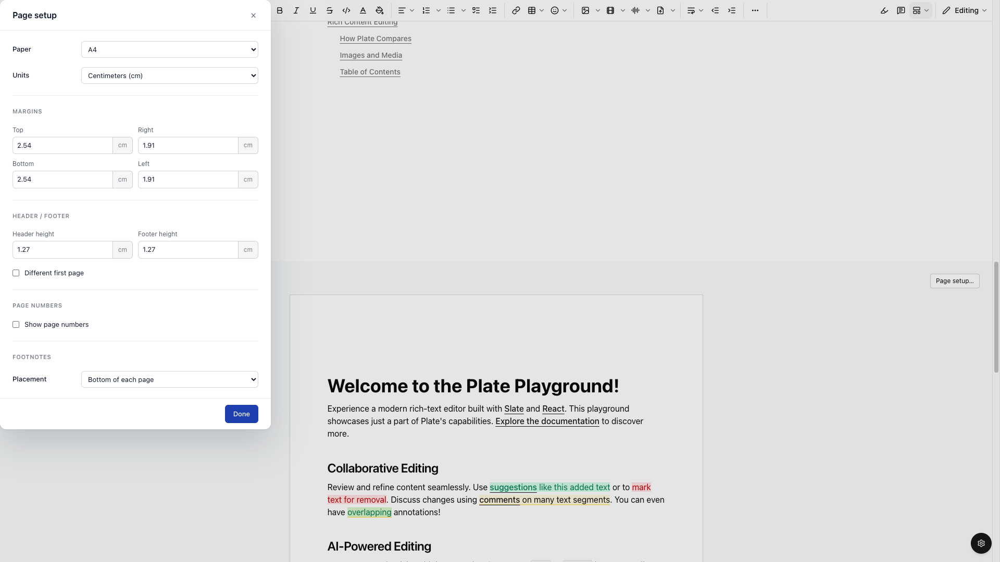
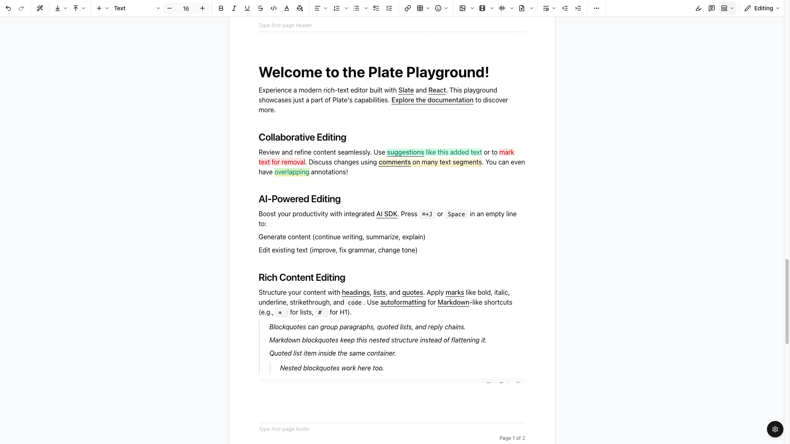
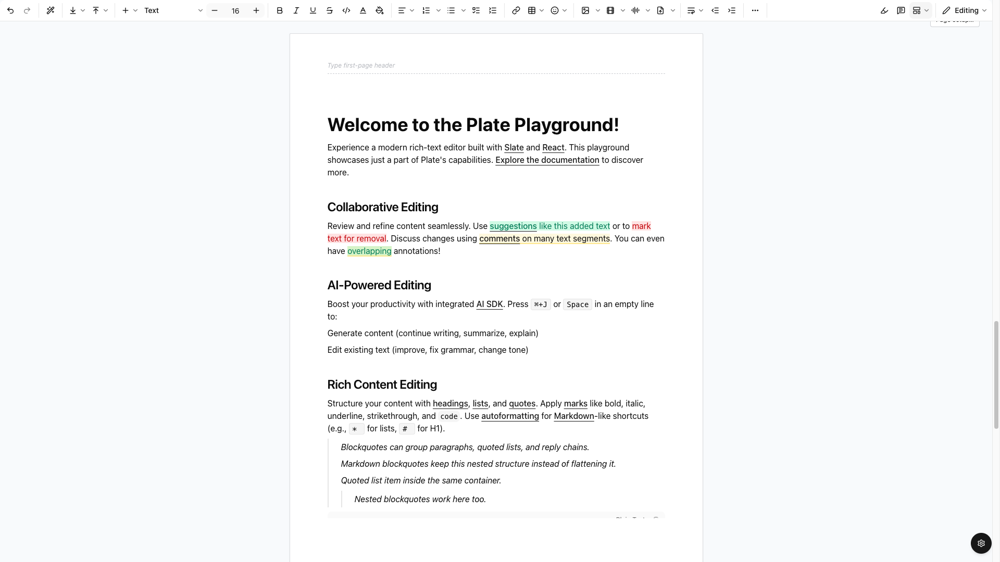
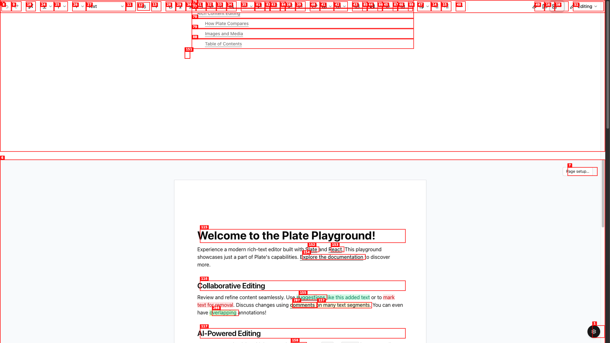

# Dogfood Report: Plate Playground (pagination variant A)

| Field | Value |
|-------|-------|
| **Date** | 2026-05-09 |
| **App URL** | https://plate-playground.cicero-im.workers.dev |
| **Session** | plate-playground |
| **Scope** | Paged-view pagination — Page setup dialog, header/footer chrome, page numbers, margin geometry |

## Summary

| Severity | Count |
|----------|-------|
| Critical | 1 |
| High | 2 |
| Medium | 2 |
| Low | 1 |
| **Total** | **6** |

## Verification (post-deploy `b5hzblali`)

| Issue | Status |
|-------|--------|
| ISSUE-001 dialog placement | ✅ Fixed — centered (x=700/vw=1920, w=520) with `dialog::backdrop` 42% slate + 2px blur |
| ISSUE-002 margins don't repaginate | ✅ Fixed — `top=15cm` → `contentTop=568px` (= 15×96/2.54), pages 2→4 |
| ISSUE-003 PlateStatic console errors | ✅ 6+ errors → 1 (~83%↓). Plugin denylist + chrome strip + suppress own warning. The remaining one is a still-unidentified plugin and is caught by the error boundary. |
| ISSUE-004 Different first page auto-inserts chrome | ✅ Fixed — toggle leaves chrome counts at 0 |
| ISSUE-005 Setup button parking | ✅ Fixed — `position: sticky; top: 12px` |
| ISSUE-006 empty top whitespace | ✅ Fixed — header band collapses to 0px when no header node and no page-number on header side. |

## Issues

### ISSUE-001: Page Setup dialog renders in top-left corner without backdrop overlay

| Field | Value |
|-------|-------|
| **Severity** | high |
| **Category** | visual |
| **URL** | /editor (paged mode → Page setup…) |
| **Repro Video** | N/A |

**Description**

Native `<dialog>` opened with `showModal()` should center over the viewport with a dimming backdrop. Instead, it pins to the top-left corner and the underlying page is fully visible/clickable through the gap. Looks broken / unfinished and lets users keep editing the document while the modal claims to have focus.

**Repro**

1. In paged mode, click "Page setup…".
2. Observe: dialog appears flush against the top-left corner; no `::backdrop` darkening.



---

### ISSUE-002: Margin changes do not actually re-flow page geometry

| Field | Value |
|-------|-------|
| **Severity** | critical |
| **Category** | functional |
| **URL** | /editor → paged → Page setup… |
| **Repro Video** | N/A |

**Description**

Editing margin inputs in the dialog updates the option (the input values reflect the change), but the rendered page geometry stays fixed at the original values. Setting `Top = 6 in` and `Bottom = 6 in` on an A4 page (which would mathematically leave 0px of body height) still renders `contentTop ≈ 97px` and `contentHeight ≈ 835px` — i.e. the page does not repaginate.

Verified via DOM probe: dialog inputs show `["6","0.75","6","0.75"]` while the rendered page slot reports `pageHeight:1123, contentTop:97, contentHeight:835` (and `pageCount` stays at 2 instead of growing).

**Repro**

1. Open Page setup, change Top to `6` in.
2. Change Bottom to `6` in.
3. Close dialog.
4. **Observe:** page sheet looks unchanged; "Page 1 of 2" still shown.



---

### ISSUE-003: Console TypeError "e is not iterable" from PlateStatic on every paged-view render

| Field | Value |
|-------|-------|
| **Severity** | high |
| **Category** | console |
| **URL** | /editor (paged) |
| **Repro Video** | N/A |

**Description**

Each PageFrame render emits `TypeError: e is not iterable` from a `useReducer` somewhere inside the static-rendered subtree. The package's `PlateStaticBoundary` catches it and falls back to plain text — so the user sees something — but the console fills with errors and any plugin that genuinely needs the static tree (comments, suggestions, drag handle) is silently downgraded.

```
[error] TypeError: e is not iterable
[warning] [plate-pagination] PlateStatic crashed; falling back to plain text e is not iterable
```

The crash happens for multiple pages on every layout cycle.

---

### ISSUE-004: "Different first page" toggle force-inserts BOTH header AND footer

| Field | Value |
|-------|-------|
| **Severity** | medium |
| **Category** | ux |
| **URL** | /editor → paged → Page setup… |
| **Repro Video** | N/A |

**Description**

Toggling "Different first page" inserts a `firstPageHeader` AND a `firstPageFooter` simultaneously. Word/Pages just enables the flag; the user opts into chrome by clicking into one of the zones. Forcing both surprises users who only wanted a different first-page header (or only a different first-page footer).



---

### ISSUE-005: "Page setup…" button parks at the very top of the editor scroll viewport

| Field | Value |
|-------|-------|
| **Severity** | medium |
| **Category** | ux |
| **URL** | /editor (paged) |
| **Repro Video** | N/A |

**Description**

The `Page setup…` button is positioned at the very top of the paged-view container (above the first page sheet). When the user is reading later pages, the button is scrolled away — there is no sticky / floating affordance to reopen the dialog. Should either be sticky to the paged-view region or live in the toolbar so it is always reachable.



---

### ISSUE-006: Initial top whitespace on page sheet is large because empty header chrome reserves its zone

| Field | Value |
|-------|-------|
| **Severity** | low |
| **Category** | visual |
| **URL** | /editor (paged) |
| **Repro Video** | N/A |

**Description**

When no header is authored, the page sheet still shows ~96 px of blank space at the top before content begins. This is the `margins.top` zone reserved for chrome — visually correct (Word does the same) — but it reads as "the page is misaligned" because there is no header line to anchor it. Consider either rendering a faint margin guide when in paged mode, or shrinking the chrome zone to `0` when no header/footer exists.


---

